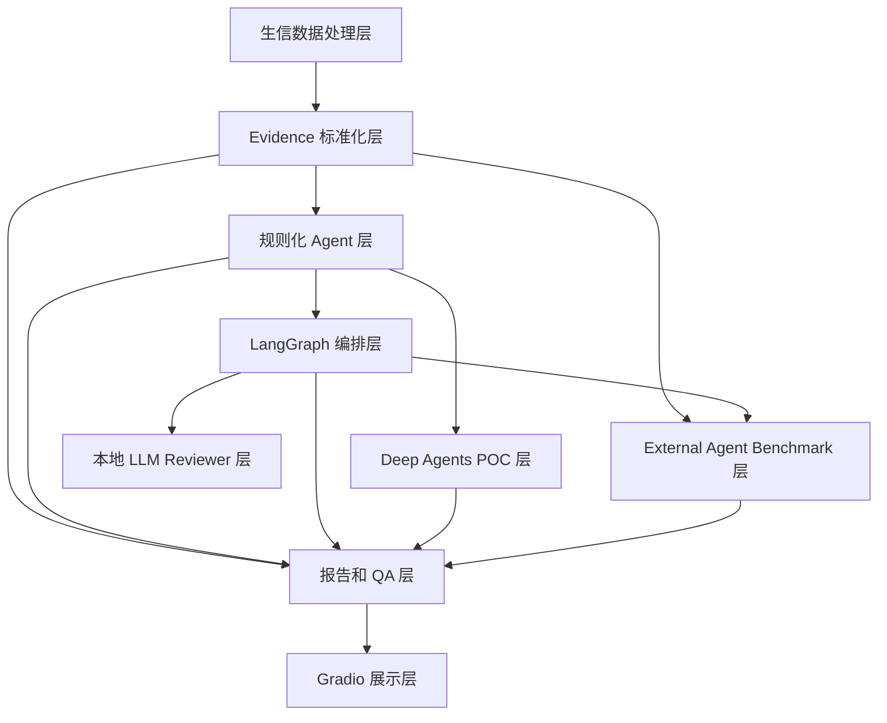

# 项目代码地图

> Deprecated: 这份代码地图已被 `docs/architecture_overview.md`、`docs/project_onboarding.md` 和 `docs/developer/code_walkthrough_for_meeting.md` 收敛。若只是想快速上手，请先读这些 canonical 文档。

适用读者：新加入项目的同学、需要并行开发 Agent / workflow / Gradio 展示的开发者。  
阅读目标：用一份文档理解 `breeding-agent` 的目录职责、上下游关系和当前架构分层。

## 1. 当前整体架构

当前实现按职责分为七层：



| 层级 | 当前实现 | 说明 |
| --- | --- | --- |
| 生信数据处理层 | RNA-seq DEG、metabolomics evidence、genomics region、candidate variant calling | 负责从本地数据或已有结果表生成可复现输出 |
| Evidence 标准化层 | `integration/` | 把 transcriptomics / metabolomics / annotation / literature / variant evidence 整成小型 TSV 和候选表 |
| 规则化 Agent 层 | `agents/` | Literature、MarkerRecommendation、Validation、Reviewer、FinalQA，默认不调用 LLM |
| LangGraph 编排层 | `graphs/` + `workflows/flavonoid_marker_langgraph.py` | 当前主线开源智能体编排框架 |
| Deep Agents POC 层 | `deepagents/` | 并行 POC，不替代 LangGraph |
| External Agent Benchmark 层 | `external_agents/` + `workflows/lobster_external_agent_benchmark.py` | Lobster-style mock reference benchmark，不真实运行 Lobster |
| 本地 LLM Reviewer 层 | `llm/` | OpenAI-compatible adapter，只增强 LangGraph ReviewerAgent |
| Gradio 展示层 | `web/gradio_app.py` | 顶部 `gr.Tab` 页面，只展示和触发本地 workflow |

## 2. 目录职责地图

| 目录 | 业务职责 | 输入 | 输出 | 上游模块 | 下游模块 | 分层 |
| --- | --- | --- | --- | --- | --- | --- |
| `src/breeding_agent/cli/` | 命令行入口，解析参数并构造 config | CLI 参数、本地路径 | 控制台状态、workflow 返回值 | 用户命令 | `workflows/` | 入口层 |
| `src/breeding_agent/workflows/` | 编排任务、创建输出目录、写 manifest / QA | config dataclass、本地输入路径 | `outputs/...` 下的报告、表格、manifest、QA | `cli/`、Gradio | `modules/`、`integration/`、`agents/`、`graphs/`、`reports/` | 生信处理层和智能体 workflow 层 |
| `src/breeding_agent/modules/` | 面向单一组学或任务的业务后端 | 数据包目录、gene sequence、候选区域数据 | 中间 TSV、schema、候选表 | `workflows/` | `reports/`、`integration/` | 生信处理层 |
| `src/breeding_agent/integration/` | Evidence 标准化、候选表聚合、QA | evidence TSV、workflow 输出 | 标准 evidence、候选表、QA dict | `workflows/`、`scripts/demo/` | `agents/`、`reports/` | Evidence 标准化层 |
| `src/breeding_agent/agents/` | 规则化智能体和 LLM-ready interface | agent context、candidate rows、报告草稿 | `AgentOutput`、审阅文本、验证计划 | `integration/`、`context_builder` | `workflows/`、`graphs/`、`deepagents/` | 智能体聚合分析层 |
| `src/breeding_agent/graphs/` | LangGraph state 和 node 编排 | evidence dir、outdir、variant dir、LLM reviewer config | graph state、trace、agent outputs | LangGraph workflow wrapper | `reports/langgraph_trace_report.py`、`reports/flavonoid_marker_report.py` | LangGraph 编排层 |
| `src/breeding_agent/deepagents/` | Deep Agents POC harness | evidence dir、variant dir、context | POC trace、summary、decision table | Deep Agents workflow wrapper | `reports/`、`integration/` | 并行 POC 层 |
| `src/breeding_agent/external_agents/` | 外部多组学 Agent 参考适配和对照评测 | 标准 evidence、variant calling 输出、内部 LangGraph 输出目录 | Lobster-style reference report、comparison matrix、comparison report | `integration/`、内部 LangGraph 输出 | `workflows/lobster_external_agent_benchmark.py`、docs 汇报 | External Agent Benchmark 层 |
| `src/breeding_agent/llm/` | 本地 OpenAI-compatible LLM adapter、executor、output guard | LLM config、ReviewerAgent context | guarded reviewer text 或 fallback metadata | `graphs/flavonoid_marker_graph.py` | ReviewerAgent node trace/report | LLM 接入层 |
| `src/breeding_agent/reports/` | Markdown / trace / decision table 生成 | 候选表、QA、agent outputs、manifest 数据 | Markdown 报告、trace JSON、decision table TSV | workflows、graphs、deepagents | Gradio、CLI 用户 | 报告生成层 |
| `src/breeding_agent/web/` | Gradio 顶部 Tab 工作台 | 本地路径、按钮输入 | 页面状态、表格、Markdown、JSON 展示 | 用户浏览器 | workflows、已有输出文件 | 前端展示层 |
| `tests/` | 行为安全网 | 临时目录、mock 数据、现有 evidence | unittest 结果 | 开发者 | 提交前验证 | 测试验证层 |
| `docs/` | 架构、使用、开发和边界说明 | 当前实现状态 | Markdown 文档 | 代码和运行结果 | 新同学、Codex、老师汇报 | 文档层 |
| `workflows/rnaseq_deg/R/` | limma-voom R 差异表达脚本 | featureCounts count matrix | DEG TSV | RNA-seq workflow | report / integration | 生信处理层 |

## 3. 生信处理层

当前实现包括：

- `workflows/rnaseq_deg.py` + `workflows/rnaseq_deg/R/differential_expression_limma_voom.R`：RNA-seq DEG reproduction。
- `modules/metabolomics/metabolomics_evidence.py`：读取学长数据包已有代谢组结果表，生成 evidence analysis 输出。
- `modules/genomics/genomics_region.py`：整理目标基因区域、注释和 marker readiness，未调用 variant 时保留 `variant_status=not_called`。
- `modules/genomics/variant_calling.py`：Candidate Variant Calling MVP，调用已有 samtools/bcftools 命令，输出真实 SNP/InDel 和 PASS/LowQual 分层。
- `modules/promoter/` + `workflows/promoter_design.py`：Promoter Design scaffold，不训练模型、不生成真实启动子。

边界：这些模块不能伪造 SNP/InDel、DOI 或启动子序列；candidate-region calling 不能替代 WGS/GBS 群体变异检测。

## 4. Evidence 标准化层

`integration/` 负责把不同来源压缩为可追踪的小表：

- transcriptomics evidence
- metabolomics evidence
- annotation evidence
- literature evidence
- genome variant evidence
- optional candidate variant calling evidence

这些小表进入 flavonoid marker aggregation、agent context、LangGraph 和 Gradio 展示。

## 5. 规则化 Agent 层

当前已有 Agent：

- `FlavonoidLiteratureAgent`
- `FlavonoidMarkerRecommendationAgent`
- `FlavonoidValidationAgent`
- `FlavonoidReviewerAgent`
- `FlavonoidFinalQAAgent`

它们都以规则化实现为 fallback，并通过 `AgentOutput` 暴露统一结果。当前只有 LangGraph workflow 的 ReviewerAgent 可选接入本地 LLM。

## 6. LangGraph 编排层

LangGraph 是当前主线开源智能体编排框架。节点顺序：

```text
load_evidence
-> aggregate_candidates
-> build_agent_context
-> literature_agent
-> marker_recommendation_agent
-> validation_agent
-> reviewer_agent
-> final_qa_agent
-> report
-> write_outputs
```

输出：

- `graph/graph_trace.json`
- `graph/graph_state_final.json`
- `graph/node_decision_table.tsv`
- `graph/langgraph_summary.md`

## 7. Deep Agents POC 层

Deep Agents POC 复用 context builder 和规则 agents，生成 deterministic trace / summary / decision table。它验证未来更高层 agent harness 的接入方式，但当前不替代 LangGraph、不调用真实 LLM。

## 8. External Agent Benchmark 层

`external_agents/` 当前实现 Lobster-style reference benchmark：

- 参考项目：`https://github.com/the-omics-os/lobster`
- backend_name：`lobster_ai_reference`
- backend_mode：`mock_reference`
- real_lobster_run：`false`

该层读取本项目已有 evidence 和内部 LangGraph 输出，生成：

- `lobster_reference/lobster_reference_task.json`
- `lobster_reference/lobster_style_agent_report.md`
- `lobster_reference/lobster_style_gene_assessments.tsv`
- `comparison/comparison_matrix.tsv`
- `comparison/lobster_vs_internal_comparison.md`
- `logs/benchmark_manifest.json`

边界：当前不安装、不导入、不真实运行 Lobster；只用于建立外部多组学 Agent 框架的对照口径。

## 9. 本地 LLM Reviewer 层

当前实现：

- Windows LM Studio 部署 Qwen3.5-9B。
- Debian VM 通过 OpenAI-compatible API 访问。
- 请求体传递 `chat_template_kwargs.enable_thinking=false`。
- 只增强 LangGraph `reviewer_agent_node`。
- 输出经过 `output_guard` 和 FinalQAAgent。
- 失败、空内容或 guard 不通过时 fallback 到规则版 ReviewerAgent。

边界：LLM 不直接生成 SNP/InDel/KASP/CAPS 结论。

## 10. Gradio 展示层

当前 Gradio 使用顶部 `gr.Tab`：

- Transcriptomics DEG Module
- Metabolomics Module
- Genomics / GWAS Module
- Integration & Recommendation
- 谷子黄酮候选标记推荐

黄酮 Tab 已展示 ordinary recommendation、variant evidence、LangGraph workflow、Use LLM Reviewer、LLM Config Path 和 LLM Reviewer Status。Gradio 不改变后端业务逻辑。

## 11. 新同学定位问题的方法

1. 找 CLI：先看 `src/breeding_agent/cli/`。
2. 找 workflow：跳到对应 `run_*_task()`。
3. 找核心业务：看 `modules/`、`integration/`、`agents/`。
4. 找报告：看 `reports/`。
5. 找展示：最后看 `web/gradio_app.py`。
6. 找安全边界：看 `AGENTS.md`、`docs/developer/agent_parallel_development_guide.md`。
