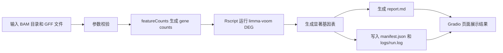

# Gradio Demo 使用说明

## Demo 目标

Agri RNA-seq DEG Agent Demo 是一个面向 RNA-seq 差异表达复现的小型 Web Demo。

它展示的核心流程是：

1. 用户输入服务器本地专业数据路径。
2. 系统调用 `featureCounts` 和 R 差异分析脚本。
3. 自动生成 counts、差异表达结果、manifest、运行日志和 Markdown 报告。
4. 页面展示结构化结果，便于检查和汇报。



## 环境要求

- Debian 虚拟机环境。
- 已配置 `rnaseq_deg` micromamba 环境。
- 环境中可用：
  - `python`
  - `featureCounts`
  - `Rscript`
  - DEG R 脚本依赖的 R 包
  - `gradio`
- 项目代码位于：

```bash
~/projects/breeding-agent
```

安装 Gradio：

```bash
micromamba activate rnaseq_deg
pip install gradio
```

或：

```bash
micromamba activate rnaseq_deg
micromamba install -c conda-forge gradio
```

## 启动命令

进入项目目录：

```bash
cd ~/projects/breeding-agent
```

启动 Web Demo：

```bash
micromamba activate rnaseq_deg
PYTHONPATH=src python -m breeding_agent.web.gradio_app
```

服务配置为：

```text
server_name = 0.0.0.0
server_port = 7860
```

## 浏览器访问方式

如果在虚拟机内部访问：

```text
http://127.0.0.1:7860
```

如果从宿主机浏览器访问 Debian 虚拟机：

```text
http://<debian-vm-ip>:7860
```

例如：

```text
http://192.168.x.x:7860
```

## 页面输入项

- `bam_dir`: BAM 文件所在目录。第一版只支持服务器本地路径，不支持上传大型 BAM 文件。
- `gff`: GFF/GFF3 注释文件路径。
- `contrast`: 差异分析对比，默认 `JM-LM`。
- `prefix`: 输出文件前缀，默认 `JM_vs_LM.mini`。
- `threads`: `featureCounts` 使用线程数，默认 `4`。
- `outdir`: 输出目录，默认 `outputs/gradio_demo_run`。

Demo benchmark 默认路径：

```text
bam_dir = ~/projects/TG5_101_mini_deg_50kb_reproduction_package/mini_deg_pipeline/bam
gff = ~/projects/TG5_101_mini_deg_50kb_reproduction_package/mini_deg_pipeline/genome.original_coords.gff
contrast = JM-LM
prefix = JM_vs_LM.mini
threads = 4
outdir = outputs/gradio_demo_run
```

## 页面按钮

- `Load Demo Benchmark`: 自动填充 mini DEG benchmark 的输入路径和默认参数。
- `Run DEG Analysis`: 调用项目中已有 workflow 执行完整 RNA-seq DEG 流程。

Web Demo 不复制业务逻辑，实际分析由 Python workflow 统一入口执行，CLI 和 Gradio 共用同一套流程。

## 页面输出

- `status`: 运行状态。成功时显示显著基因结果文件路径；失败时显示错误信息。
- `significant_genes`: 显著基因表格。
- `report.md`: 自动生成的 Markdown 报告内容。
- `manifest.json`: 结构化运行记录。
- `run.log`: 外部命令、stdout/stderr 和运行时间记录。

## 输出文件

运行成功后，输出目录中应包含：

```text
outputs/gradio_demo_run/
├── counts/
│   └── gene_counts_mini.txt
├── mini_de/
│   └── JM_vs_LM.mini.significant_genes.tsv
├── logs/
│   └── run.log
├── manifest.json
└── reports/
    └── report.md
```

## 结果解释规则

当前默认对比为：

```text
contrast = JM-LM
```

解释规则：

- `logFC > 0`: JM 组高表达。
- `logFC < 0`: LM 组高表达。

当前 mini benchmark 的目标基因为：

```text
Si9g04210.1
```

当前结果中该基因 `logFC < 0`，因此解释为：

```text
Si9g04210.1 在 LM 组显著高表达。
```

## 常见注意事项

- 页面输入的是服务器本地路径，不是用户电脑本地路径。
- `bam_dir` 中优先查找 `*.mini.sorted.bam`，如果没有则查找 `*.bam`。
- GFF 默认使用 `genome.original_coords.gff`，并要求包含 exon 和 `Parent=` 信息。
- 运行前确认 `featureCounts` 和 `Rscript` 在当前环境 PATH 中。
- 如果运行失败，优先查看页面中的 `status`、`manifest.json` 和 `run.log`。
- 如果从宿主机无法访问页面，检查虚拟机 IP、网络模式和 7860 端口是否可访问。

