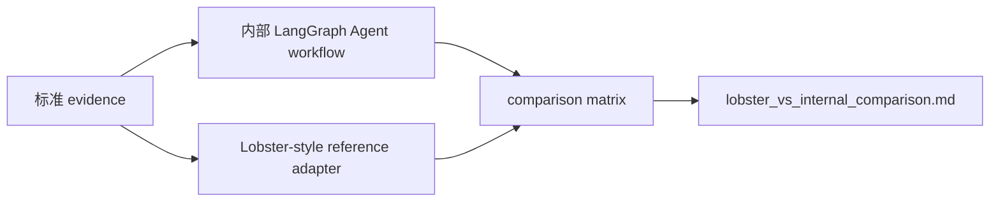

# Lobster-style External Omics Agent Benchmark

适用读者：需要向老师说明“外部多组学 Agent 框架如何与本项目对照”的同学，以及后续准备接入真实 Lobster adapter 的开发者。  
阅读目标：明确当前 benchmark 的定位、输入输出、比较维度和能力边界。

## 1. 为什么选择 Lobster AI

当前参考对象是开源项目 Lobster AI：

- 项目名：Lobster AI
- GitHub：`https://github.com/the-omics-os/lobster`
- 参考原因：它面向 bioinformatics / multi-omics multi-agent 场景，包含 specialist omics agents，并使用 LangGraph supervisor 进行编排。

这与本项目当前的 LangGraph 多智能体 workflow 最接近，因此适合作为“外部多组学 Agent 框架”的第一阶段对照对象。

## 2. 当前实现定位

当前实现是 **Lobster-style reference benchmark**，不是 Lobster 真实运行结果。

当前实现做的事情：

- 读取本项目已有 transcriptomics / metabolomics / annotation / literature / variant evidence。
- 按 Lobster-style 多组学 specialist-agent 解释范式生成参考报告。
- 与本项目内部 LangGraph Agent 输出做矩阵对照。
- 输出 reference report、gene assessment table 和 comparison report。

当前实现不做的事情：

- 不安装 Lobster。
- 不导入 Lobster Python 包。
- 不调用 Lobster agent。
- 不调用外部 API。
- 不运行真实 LLM。
- 不新增 DOI。
- 不新增 SNP/InDel 坐标。
- 不生成真实启动子序列。

所有输出中都会明确写：

```text
This is a Lobster-style reference benchmark, not a real Lobster AI run.
```

manifest 中固定记录：

```yaml
backend_name: lobster_ai_reference
backend_mode: mock_reference
real_lobster_run: false
```

## 3. 为什么第一阶段不真实安装 Lobster

第一阶段目标是建立业务对照流程，而不是引入新的不确定依赖。

主要原因：

| 原因 | 说明 |
| --- | --- |
| 保持主线稳定 | 当前 LangGraph + rules + local LLM Reviewer 已经跑通，不能被外部框架实验破坏 |
| 避免依赖漂移 | Lobster 真实安装可能带来额外包版本、模型后端和运行环境问题 |
| 先明确比较口径 | 老师更需要看到“外部多组学 Agent 范式与本项目育种 Agent 的差异” |
| 避免夸大能力 | 没有真实运行 Lobster 前，不能声称已完成 Lobster 集成 |

后续如果需要真实 adapter，应单独建分支，先固定环境，再做只读式 adapter。

## 4. 与当前内部 Agent 的关系

当前内部 Agent 是育种任务定制的业务 Agent：

- LiteratureAgent
- MarkerRecommendationAgent
- ValidationAgent
- ReviewerAgent
- FinalQAAgent

Lobster-style benchmark 是外部范式对照层，不替代这些 Agent。



## 5. CLI 用法

```bash
PYTHONPATH=src python3 -m breeding_agent.cli.lobster_external_agent_benchmark \
  --evidence-dir outputs/flavonoid_marker_from_package/evidence \
  --variant-calling-dir outputs/genomics_variant_calling \
  --internal-agent-outdir outputs/flavonoid_marker_langgraph_llm_real \
  --outdir outputs/lobster_external_agent_benchmark
```

参数说明：

| 参数 | 说明 |
| --- | --- |
| `--evidence-dir` | 本项目黄酮 marker 标准 evidence 目录 |
| `--variant-calling-dir` | 可选，Genomics Candidate Variant Calling 输出目录 |
| `--internal-agent-outdir` | 已运行的内部 LangGraph Agent 输出目录 |
| `--outdir` | benchmark 输出目录 |

## 6. 输出文件

```text
outputs/lobster_external_agent_benchmark/
├── lobster_reference/
│   ├── lobster_reference_task.json
│   ├── lobster_style_agent_report.md
│   └── lobster_style_gene_assessments.tsv
├── comparison/
│   ├── comparison_matrix.tsv
│   └── lobster_vs_internal_comparison.md
└── logs/
    └── benchmark_manifest.json
```

## 7. 对比维度

`comparison_matrix.tsv` 至少覆盖：

- 三个目标基因是否覆盖：`Si9g04210.1`、`Si5g31340.1`、`Si9g34380.1`
- 是否包含“群体”
- 是否包含 DOI
- 是否包含统计学证据
- 是否包含 SNP / InDel / KASP / CAPS
- 是否处理 PASS / LowQual
- 是否说明 KASP/CAPS preliminary screening
- 是否说明不能替代 WGS/GBS 群体检测
- 是否输出 graph_trace / node_decision_table / qa_check
- 是否包含本地 LLM Reviewer 状态
- 是否面向作物育种标记推荐
- 是否保留 evidence traceability

## 8. 当前自定义 Agent 的优势

相对于通用 Lobster-style 多组学解释范式，当前内部 Agent 更贴近本项目业务：

| 能力 | 当前内部 Agent 状态 |
| --- | --- |
| 育种标记任务定制 | 已围绕谷子黄酮 marker recommendation 定制 |
| 三个目标基因硬性要求 | 已固定检查 `Si9g04210.1`、`Si5g31340.1`、`Si9g34380.1` |
| SNP/InDel/KASP/CAPS 边界 | 已明确不能伪造坐标，KASP/CAPS 是 preliminary screening |
| PASS / LowQual 约束 | 已接入 Genomics Candidate Variant Calling 质量分层 |
| WGS/GBS 群体验证说明 | 已在报告和 QA 中保留限制 |
| 本地 LLM Reviewer | 已作为 LangGraph ReviewerAgent 可选增强 |
| FinalQAAgent | 已保留规则化终检 |
| Gradio 展示 | 已能展示普通推荐、LangGraph、LLM Reviewer 状态 |

## 9. 后续升级路线

后续规划可以分三步：

1. **真实 Lobster adapter 调研**：确认 Lobster 安装方式、输入 schema、输出结构和本地模型支持方式。
2. **只读 adapter**：把本项目 evidence 转成 Lobster 可读输入，真实运行后只读取 Lobster 输出，不让它修改内部结果。
3. **正式对照评测**：将真实 Lobster 输出与内部 LangGraph 输出纳入同一 comparison matrix。

升级时仍需遵守：

- 不伪造 SNP/InDel 位点。
- 不伪造 DOI。
- LowQual 不得作为优先推荐。
- preliminary KASP/CAPS 不等于最终标记。
- Candidate-region variant calling 不能替代 WGS/GBS 群体变异检测。
- Promoter scaffold 不生成真实启动子序列。
