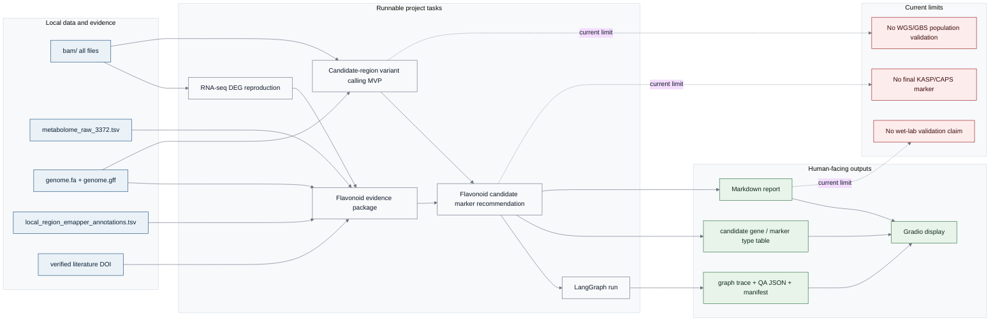
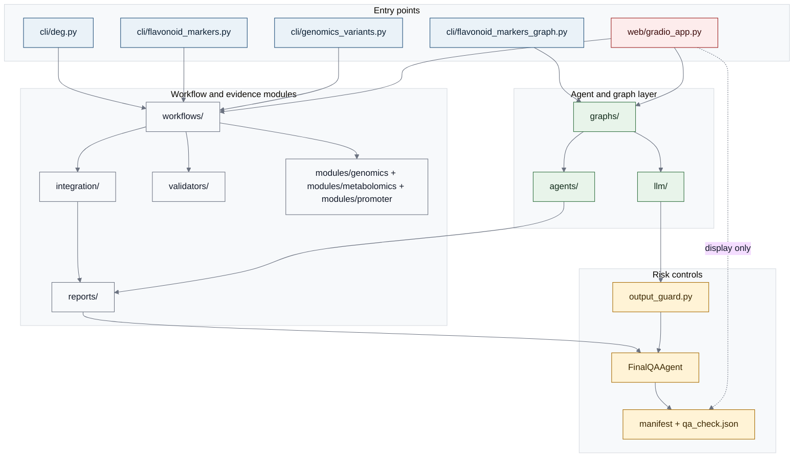
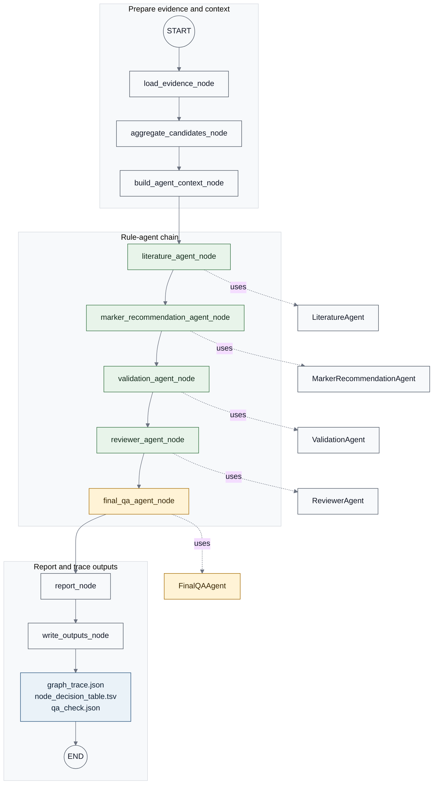
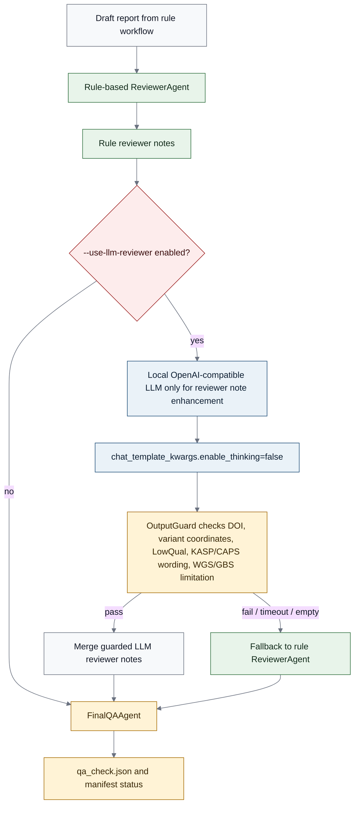
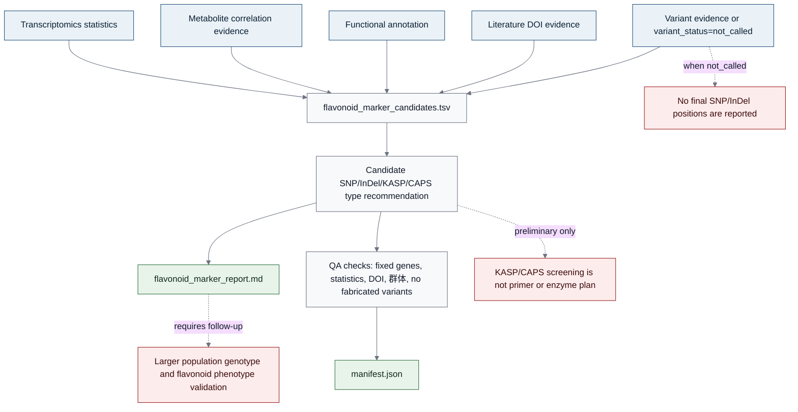
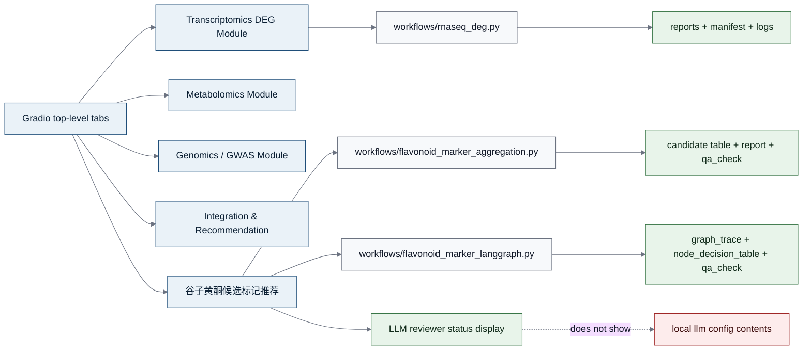

# breeding-agent 架构图 Mermaid Source

本文件先用 Mermaid 固化组会 PPT 中的架构图，再导出 SVG/PNG 放入 `presentation.pptx`。所有图均按当前仓库真实状态绘制：LangGraph 是主线多 Agent 编排层，Gradio 是展示层，LLM 只增强 ReviewerAgent，Deep Agents / Lobster-style / Promoter Design 不写成真实完成能力。

## Diagram 1: Application Architecture

## Diagram 2: Technical Architecture

## Diagram 3: LangGraph Node Flow

## Diagram 4: LLM Reviewer Guardrail

## Diagram 5: Evidence-To-Report Boundary

## Diagram 6: Gradio Boundary

