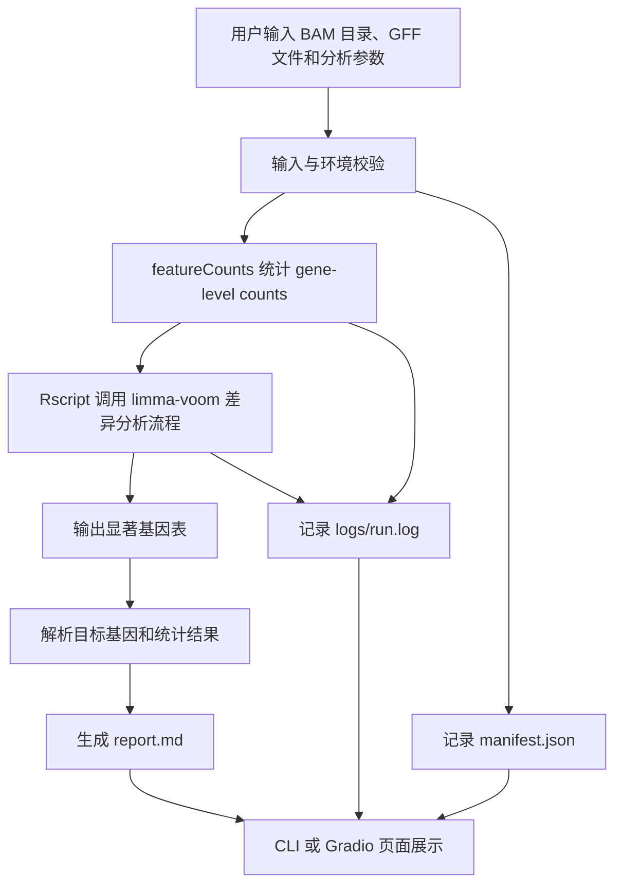

# RNA-seq DEG Tool Agent Demo 汇报简报

## 当前任务背景

本阶段目标是把已有的 mini RNA-seq DEG 复现流程，从手动脚本执行整理成一个可演示、可追踪的小型 Tool Agent Demo。

重点不是重新开发差异表达算法，而是把专业分析流程封装成一个稳定入口：

- 输入专业数据路径。
- 自动调用成熟分析工具。
- 生成结构化结果。
- 自动生成报告。
- 保留完整运行记录，便于复现和排错。

## 系统整体流程



## DeepRare-like 对应关系

这里的 DeepRare-like 主要指一种工作流形态，而不是复刻 DeepRare 的具体模型。

| DeepRare-like 环节 | 当前 Demo 对应实现 |
| --- | --- |
| 用户输入专业数据 | 输入 BAM 目录、GFF 文件、contrast、prefix、threads、outdir |
| 系统调用专业工具 | 调用 `featureCounts` 和 R 差异表达分析脚本 |
| 生成结构化结果 | 输出 gene counts、显著基因 TSV、manifest JSON |
| 自动生成报告 | 生成 `reports/report.md` |
| 可追踪运行过程 | 保存 `logs/run.log` 和 `manifest.json` |
| 可交互演示 | 提供 Gradio Web Demo |

## 当前已完成工作

已经完成一个最小可用的 RNA-seq DEG Tool Agent Demo：

- Python CLI：
  - `python -m breeding_agent.cli.deg`
  - 支持传入 BAM 目录、GFF、contrast、prefix、threads、outdir。
- Workflow 封装：
  - 自动查找 BAM 文件。
  - 创建输出目录。
  - 调用 `featureCounts`。
  - 调用 R 差异分析脚本。
  - 检查显著基因结果。
- 输入校验：
  - 检查 BAM 目录。
  - 检查 GFF 文件。
  - 检查 `featureCounts` 和 `Rscript`。
- 运行追踪：
  - `logs/run.log`
  - `manifest.json`
- 报告生成：
  - `reports/report.md`
  - 自动解析目标基因 `Si9g04210.1`。
- Gradio Web Demo：
  - 页面标题为 `Agri RNA-seq DEG Agent Demo`。
  - 支持一键加载 demo benchmark。
  - 支持在页面运行 DEG 分析并展示结果。

## Demo 演示步骤

1. 启动环境：

```bash
cd ~/projects/breeding-agent
micromamba activate rnaseq_deg
```

2. 启动 Gradio Demo：

```bash
PYTHONPATH=src python -m breeding_agent.web.gradio_app
```

3. 浏览器访问：

```text
http://<debian-vm-ip>:7860
```

4. 点击：

```text
Load Demo Benchmark
```

页面会自动填充：

```text
bam_dir = ~/projects/TG5_101_mini_deg_50kb_reproduction_package/mini_deg_pipeline/bam
gff = ~/projects/TG5_101_mini_deg_50kb_reproduction_package/mini_deg_pipeline/genome.original_coords.gff
contrast = JM-LM
prefix = JM_vs_LM.mini
threads = 4
outdir = outputs/gradio_demo_run
```

5. 点击：

```text
Run DEG Analysis
```

6. 查看页面输出：

- 运行状态。
- 显著基因表。
- Markdown 报告。
- manifest JSON。
- run log。

## 当前结果解释

当前 mini benchmark 的目标基因为：

```text
Si9g04210.1
```

默认对比为：

```text
contrast = JM-LM
```

解释规则：

- `logFC > 0`: JM 组高表达。
- `logFC < 0`: LM 组高表达。

当前结果中：

```text
Si9g04210.1 的 logFC < 0
```

因此结论是：

```text
Si9g04210.1 在 LM 组显著高表达。
```

这说明当前 CLI 和 Web Demo 能够复现 mini DEG benchmark 中的目标基因结果。

## 后续计划

后续可以围绕三个方向继续扩展：

1. 输入形式扩展：
   - 支持更多样本分组配置。
   - 支持更通用的 contrast 设置。
   - 后续再考虑上传小型示例文件，大型 BAM 仍建议走服务器路径。

2. 报告能力增强：
   - 增加 top DEG 表格。
   - 增加目标基因 counts 可视化。
   - 增加参数和软件版本摘要。

3. Tool Agent 能力增强：
   - 增加任务状态管理。
   - 增加历史任务列表。
   - 后续再接入大模型解释层，但第一阶段保持工具流程稳定和可复现。

