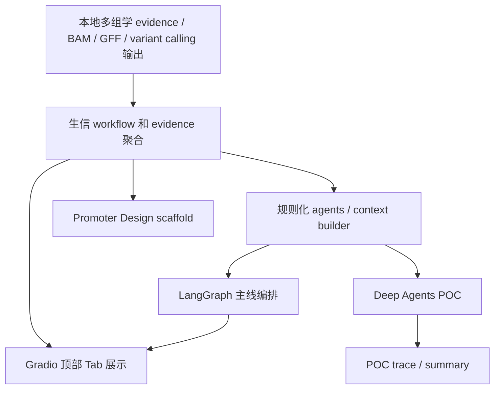

# Multi-omics Breeding Agent Demo 汇报简报

适用读者：准备给老师或学长汇报当前 demo 的同学。  
阅读目标：用简短材料说明当前完成内容、演示路径和未完成边界。

## 当前任务背景

当前项目已经从最初的 mini RNA-seq DEG 复现 Demo，扩展为谷子多组学育种智能体 Demo。主线包括生信数据处理层和智能体聚合分析层：

- 生信数据处理层：RNA-seq DEG、metabolomics evidence analysis、genomics region analysis、Genomics Candidate Variant Calling MVP。
- 智能体聚合分析层：flavonoid marker recommendation、LLM-ready rule agents、LangGraph 多智能体 workflow、Deep Agents POC。
- 设计型任务准备：Promoter Design scaffold。

重点不是重新开发差异表达、variant calling 或启动子生成算法，而是把专业分析流程封装成稳定、可追踪、可汇报的入口：

- 输入专业数据路径。
- 自动调用成熟分析工具。
- 生成结构化结果。
- 自动生成报告。
- 保留完整运行记录，便于复现和排错。

## 系统整体流程



## DeepRare-like 对应关系

这里的 DeepRare-like 主要指一种工作流形态，而不是复刻 DeepRare 的具体模型。

| DeepRare-like 环节 | 当前 Demo 对应实现 |
| --- | --- |
| 用户输入专业数据 | 输入 BAM/GFF、evidence TSV、variant calling 目录、gene sequence/function 等 |
| 系统调用专业工具 | 调用 RNA-seq DEG、metabolomics/genomics modules、candidate variant calling workflow |
| 生成结构化结果 | 输出候选基因/候选标记表、variant tables、manifest JSON、QA JSON |
| 自动生成报告 | 生成 DEG、omics、flavonoid marker、LangGraph、Deep Agents POC、Promoter scaffold 报告 |
| 可追踪运行过程 | 保存 run log、manifest、graph trace、decision table |
| 可交互演示 | 提供顶部 `gr.Tab` Gradio Workbench |

## 当前已完成工作

已经完成：

- RNA-seq DEG CLI：
  - `python -m breeding_agent.cli.deg`
  - 支持传入 BAM 目录、GFF、contrast、prefix、threads、outdir。
- 谷子黄酮候选标记推荐：
  - 满足 `Si9g04210.1`、`Si5g31340.1`、`Si9g34380.1`、`群体`、文献查阅、DOI、统计值、SNP/InDel/KASP/CAPS 推荐要求。
  - 可选接入 Genomics Candidate Variant Calling MVP 输出。
- Genomics Candidate Variant Calling MVP：
  - 输出 PASS/LowQual、SNP/InDel、KASP/CAPS preliminary screening 表。
- LLM-ready Agent Interface：
  - 当前默认规则化，不调用真实 LLM。
- LangGraph workflow：
  - 主线开源智能体编排框架，已接入 Gradio 展示。
- Deep Agents POC：
  - 已跑通并输出 trace/summary/decision table，但不替代 LangGraph。
- Promoter Design scaffold：
  - 已定义任务、schema、数据盘点和占位 CLI/workflow，不训练模型，不生成真实启动子序列。
- Gradio Web Demo：
  - 页面标题为 `Agri Multi-omics Breeding Agent Demo`。
  - 使用顶部 `gr.Tab` 结构，不是左侧 sticky dashboard。
  - 支持展示 Transcriptomics、Metabolomics、Genomics / GWAS、Integration & Recommendation 和谷子黄酮候选标记推荐。

## Demo 演示步骤

1. 启动环境：

```bash
cd ~/projects/breeding-agent
micromamba activate rnaseq_deg
```

2. 启动 Gradio Demo：

```bash
PYTHONPATH=src python3 -m breeding_agent.web.gradio_app
```

3. 浏览器访问：

```text
http://<debian-vm-ip>:7860
```

4. 在顶部 Tab 中选择需要演示的模块。RNA-seq 可点击：

```text
Load Demo Benchmark
```

页面会自动填充：

```text
bam_dir = ~/projects/TG5_101_mini_deg_50kb_reproduction_package/mini_deg_pipeline/bam
gff = ~/projects/TG5_101_mini_deg_50kb_reproduction_package/mini_deg_pipeline/genome.original_coords.gff
contrast = JM-LM
prefix = JM_vs_LM.mini
threads = 4
outdir = outputs/gradio_demo_run
```

5. 点击：

```text
Run DEG Analysis
```

6. 查看页面输出：

- 运行状态。
- 显著基因表。
- Markdown 报告。
- manifest JSON。
- run log。

## 当前能力边界

- 不伪造 SNP/InDel 位点。
- 不伪造 DOI。
- 不伪造启动子序列。
- KASP/CAPS 表只是 preliminary screening，不是最终引物或酶切方案。
- Candidate-region variant calling 不能替代 WGS/GBS 群体变异检测。
- 当前本地 LLM 只增强 LangGraph ReviewerAgent，不直接生成 SNP/InDel/KASP/CAPS 结论；更多 Agent 的模型接入是后续规划。
- Promoter Design 当前只是 scaffold，不是启动子生成模型。

## 后续计划

后续可以围绕三个方向继续扩展：

1. 输入形式扩展：
   - 支持更多样本分组配置。
   - 支持更通用的 contrast 设置。
   - 后续再考虑上传小型示例文件，大型 BAM 仍建议走服务器路径。

2. 报告能力增强：
   - 增加 top DEG 表格。
   - 增加目标基因 counts 可视化。
   - 增加参数和软件版本摘要。

3. 智能体能力增强：
   - 在保留规则 fallback 的前提下，评估 ReviewerAgent + Ollama/Qwen 等本地开源模型 adapter。
   - 继续保持 LangGraph 为主线编排框架，Deep Agents 作为并行 POC。
   - 为 Promoter Design 积累高可信 promoter activity 数据集后再考虑生成模型。
